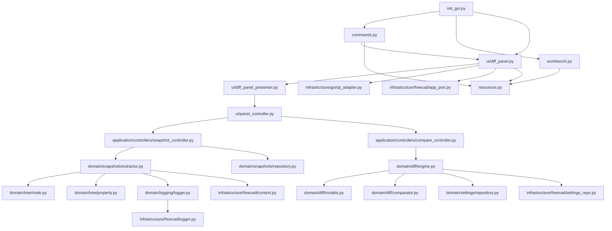
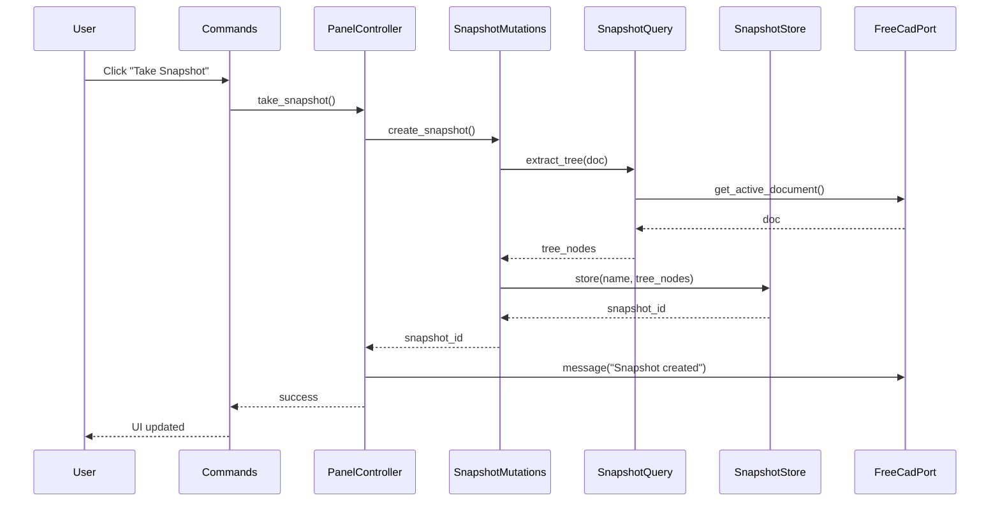
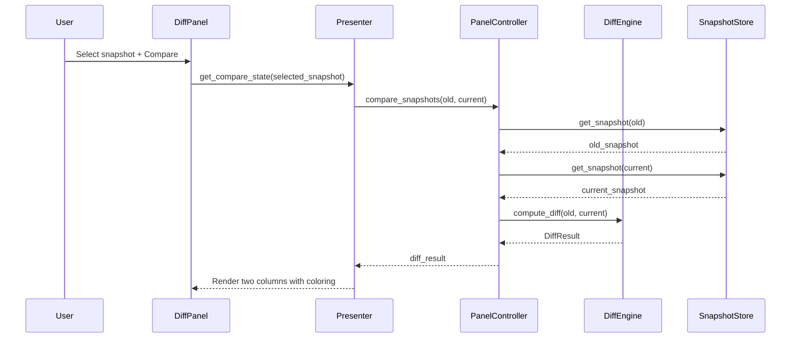

# Diff Workbench Implementation Plan

This document describes the implementation plan for the **Diff Workbench** FreeCAD addon, modeled after the DataManager workbench architecture with clean separation of concerns, ports and adapters pattern, and comprehensive testing support.

## Goals

- Provide a FreeCAD workbench entrypoint (commands, toolbar/menu, panel)
- Keep the Qt UI layer thin by delegating behavior to presenters/controllers
- Isolate FreeCAD-specific document queries/mutations from core diff logic
- Make core modules importable and testable without a running FreeCAD GUI
- Use ports and adapters for runtime boundaries (FreeCAD, GUI, Settings)
- Implement comprehensive linting and unit testing
- Store user-facing documentation in the main README.md at project root

## High-level Structure

### Directory Layout

```
freecad_diff_workbench/
├── README.md                          # User-facing documentation
├── pyproject.toml                     # Project configuration, dependencies, tooling
├── CMakeLists.txt                     # FreeCAD addon registration
├── package.xml                        # FreeCAD addon metadata
├── MANIFEST.in                        # Package inclusion rules
├── .ruff.toml                         # Ruff linting configuration
├── .editorconfig                      # Editor configuration
├── Taskfile.yml                       # Task automation (optional)
│
├── freecad/
│   └── diff_wb/                       # Main package
│       ├── __init__.py
│       ├── init_gui.py                # FreeCAD entrypoint
│       ├── version.py                 # Version info
│       ├── resources.py               # Resource path management
│       ├── config.py                  # Hard-coded configuration (deprecated)
│       │
│       ├── entrypoints/               # FreeCAD integration
│       │   ├── __init__.py
│       │   ├── commands.py            # Command registrations
│       │   └── workbench.py           # Workbench registration
│       │
│       ├── domain/                    # Pure domain models (no FreeCAD deps)
│       │   ├── __init__.py
│       │   ├── tree/                  # Shared tree models
│       │   │   ├── __init__.py
│       │   │   ├── node.py            # TreeNode dataclass
│       │   │   └── property.py        # Property, Vector, Rotation, Placement
│       │   ├── snapshots/             # Snapshot domain concept
│       │   │   ├── __init__.py
│       │   │   ├── models.py          # Snapshot dataclass
│       │   │   ├── extractor.py       # SnapshotExtractor (uses Logger)
│       │   │   └── repository.py      # SnapshotRepository + InMemory impl
│       │   ├── diff/                  # Diff domain concept
│       │   │   ├── __init__.py
│       │   │   ├── models.py          # DiffResult, NodeDiff, PropertyDiff
│       │   │   ├── engine.py          # DiffEngine (uses SettingsRepository)
│       │   │   └── comparator.py      # TreeComparator, PropertyComparator
│       │   ├── settings/              # Settings domain concept
│       │   │   ├── __init__.py
│       │   │   ├── models.py          # Settings dataclass
│       │   │   └── repository.py      # SettingsRepository protocol
│       │   └── logging/               # Logging domain concept
│       │       ├── __init__.py
│       │       └── logger.py          # Logger protocol
│       │
│       ├── infrastructure/            # External adapters
│       │   ├── __init__.py
│       │   ├── freecad/
│       │   │   ├── __init__.py
│       │   │   ├── context.py         # FreeCadContext + FreeCadPort adapter
│       │   │   ├── settings_repo.py   # SettingsRepository implementation
│       │   │   └── app_port.py        # AppPort implementation
│       │   ├── gui/
│       │   │   ├── __init__.py
│       │   │   └── qt_adapter.py      # GuiPort implementation
│       │   └── persistence/
│       │       ├── __init__.py
│       │       └── snapshot_repo.py   # (Future: FileBasedSnapshotRepository)
│       │
│       ├── ui/                        # UI layer (Qt widgets only)
│       │   ├── __init__.py
│       │   ├── diff_panel.py          # Qt widget (thin view layer)
│       │   ├── diff_panel_presenter.py# Presenter for UI state/formatting
│       │   └── panel_controller.py    # UI-facing facade
│       │
│       └── resources/
│           ├── icons/
│           │   ├── Logo.svg
│           │   ├── TakeSnapshot.svg
│           │   ├── Compare.svg
│           │   └── SwapColumns.svg
│           ├── translations/
│           │   ├── README.md
│           │   └── diff_wb_es-ES.ts
│           └── ui/
│               └── diff_panel.ui
│
├── tests/
│   ├── conftest.py                    # pytest fixtures
│   ├── unit/                          # Unit tests (no FreeCAD)
│   │   ├── test_tree_diff.py
│   │   ├── test_property_diff.py
│   │   ├── test_diff_engine.py
│   │   ├── test_diff_panel_presenter.py
│   │   ├── test_snapshot_store.py
│   │   ├── test_ports.py
│   │   └── test_version.py
│   ├── integration/                   # Integration tests (with FreeCAD)
│   │   ├── test_snapshot_query.py
│   │   ├── test_snapshot_mutations.py
│   │   └── test_diff_panel.py
│   └── freecad/                       # FreeCAD test fixtures
│       └── create_test_document.py
│
└── docs/                              # Development documentation
    ├── PLAN.md                        # Implementation plan and architecture
    ├── ARCHITECTURE.md                # Architecture overview (layered DDD)
    ├── feature_development.md         # Development process and phases
```
```

## Architectural Principles

### 1. Ports at Runtime Boundaries

| Port | Responsibility | Implementation |
|------|---------------|----------------|
| **FreeCadPort** | Document access, recompute, GUI updates | `freecad_port.py` |
| **GuiPort** | PySideUic loading, MDI integration | `gui_port.py` |
| **SettingsPort** | Persisted settings (excluded types/properties) | `settings_port.py` |
| **AppPort** | Translation functionality | `app_port.py` |

Each port has:
- A Protocol interface definition
- A runtime adapter using real FreeCAD APIs
- Test doubles/fakes for unit testing

### 2. Dependency Injection

- Data/query/mutation functions accept `ctx: FreeCadContext | None` and call `get_port(ctx)`
- UI widgets accept optional injected ports (defaults to runtime adapters)
- Core diff logic has NO FreeCAD dependencies - fully testable

### 3. Layer Responsibilities

| Layer | Responsibility | FreeCAD Dependency |
|-------|---------------|-------------------|
| **Entrypoints** | FreeCAD registration, command wiring | Yes (guarded) |
| **UI (Qt)** | Widget wiring, signal handling | Yes (via GuiPort) |
| **Presenter** | UI state, formatting, orchestration plans | No |
| **Controller** | UI-facing facade, document refresh boundary | Yes (via FreeCadPort) |
| **Domain** | Pure data models only | No |
| **Diff** | Pure diff algorithms | No |
| **Snapshot** | FreeCAD-specific queries/mutations | Yes (via FreeCadPort) |

## Module Map



## Key Components

### 1. Ports Layer (`ports/`)

#### FreeCadContext
Holds app/gui references, created at runtime:
```python
@dataclass(frozen=True)
class FreeCadContext:
    app: object  # FreeCAD module
    gui: object | None  # FreeCADGui module or None
```

#### FreeCadPort
Interface for document operations:
```python
class FreeCadPort(Protocol):
    def get_active_document(self) -> object | None: ...
    def get_object(self, doc: object, name: str) -> object | None: ...
    def get_typed_object(self, doc: object, name: str, *, type_id: str) -> object | None: ...
    def try_recompute_active_document(self) -> None: ...
    def try_update_gui(self) -> None: ...
    def translate(self, context: str, text: str) -> str: ...
    def log(self, text: str) -> None: ...
    def warn(self, text: str) -> None: ...
    def message(self, text: str) -> None: ...
```

#### GuiPort
Interface for Qt operations:
```python
class GuiPort(Protocol):
    def load_ui(self, ui_path: str) -> object: ...
    def get_main_window(self) -> object: ...
    def get_mdi_area(self) -> object | None: ...
    def add_subwindow(self, *, mdi_area: object, widget: object) -> object: ...
```

#### SettingsPort
Interface for persisted settings:
```python
class SettingsPort(Protocol):
    def value(self, key: str, default: object | None = None) -> object | None: ...
    def set_value(self, key: str, value: object) -> None: ...
```

Settings keys:
- `DiffWorkbench/ExcludedTypes`: List of type IDs to exclude (default: App::Origin)
- `DiffWorkbench/ExcludedProperties`: List of property names to exclude

#### AppPort
Interface for translation:
```python
class AppPort(Protocol):
    def translate(self, context: str, text: str) -> str: ...
```

### 2. Domain Layer (`domain/`)

Pure data models with NO FreeCAD dependencies and NO logic:

#### Snapshot
```python
@dataclass(frozen=True)
class Snapshot:
    name: str
    timestamp: datetime
    tree_nodes: list[TreeNode]
```

#### TreeNode
```python
@dataclass(frozen=True)
class TreeNode:
    name: str
    type_id: str
    properties: dict[str, PropertyValue]
    children: list[TreeNode]  # Stub for Phase 2
```

#### PropertyValue
```python
@dataclass(frozen=True)
class PropertyValue:
    type_: PropertyType
    value: Any
    expression: str | None = None

    @classmethod
    def create(cls, type_: PropertyType, value: Any, expression: str | None = None) -> "PropertyValue":
        """Factory method to create a PropertyValue with proper type handling."""
        ...
```

#### Vector, Rotation, Placement
```python
@dataclass(frozen=True)
class Vector:
    x: float
    y: float
    z: float

@dataclass(frozen=True)
class Rotation:
    axis_x: float
    axis_y: float
    axis_z: float
    angle_degrees: float

@dataclass(frozen=True)
class Placement:
    position: Vector
    rotation: Rotation
```

#### DiffResult
```python
@dataclass(frozen=True)
class DiffResult:
    added: list[TreeNode]      # New on right (green)
    deleted: list[TreeNode]    # Removed from left (crossed out)
    modified: list[NodeDiff]   # Changed properties (blue)
```

#### NodeDiff
```python
@dataclass(frozen=True)
class NodeDiff:
    node_name: str
    property_diffs: list[PropertyDiff]
```

#### PropertyDiff
```python
@dataclass(frozen=True)
class PropertyDiff:
    property_name: str
    old_value: PropertyValue
    new_value: PropertyValue
    changed_expression: bool
```

### 3. Diff Module (`diff/`)

Pure Python diff computation - ZERO FreeCAD dependencies:

#### TreeDiff
- Compares two tree structures
- Identifies added/deleted/modified nodes
- Uses node name + type_id for matching

#### PropertyDiff
- Compares property values between snapshots
- Tracks expression changes separately
- Handles type-specific comparisons

#### DiffEngine
- Orchestrates tree + property diffing between two snapshots
- **Applies excluded types/properties from SettingsPort** - this is where filtering occurs
- Excluded types: Entire nodes of excluded TypeIds are removed from diff output
- Excluded properties: Individual properties are skipped during comparison
- Returns structured DiffResult with only meaningful differences

### 4. Snapshot Module (`snapshot/`)

Snapshot management follows the same pattern as DataManager's `varsets/` module:
- Uses `FreeCadPort` via `get_port(ctx)` for all FreeCAD access
- Accepts optional `ctx: FreeCadContext` for testability
- `SnapshotStore` is pure (no FreeCAD needed)

#### SnapshotQuery
- Queries current document state
- Extracts tree structure from FreeCAD objects
- Reads ALL property values and expressions (no filtering)
- **Read-only operations only**
- **No filtering applied** - snapshots capture complete document state
- Filtering of excluded types/properties happens in [`DiffEngine`](docs/PLAN.md:345-348) during diff computation
- Uses `FreeCadPort` via `get_port(ctx)`

#### SnapshotMutations
- Orchestrates snapshot creation workflow
- Calls `SnapshotQuery` to extract document state
- Calls `SnapshotStore` to persist the snapshot
- **Mutation coordinator, not the storage itself**
- Uses `FreeCadPort` via `get_port(ctx)`

#### SnapshotStore
- Pure in-memory storage for active session
- Stores and retrieves snapshots by name/index
- Manages snapshot lifecycle (add, get, list, delete)
- **No FreeCAD dependencies - just a data store**

### 5. UI Layer (`ui/`)

#### DiffPanel
- Qt widget loading `diff_panel.ui`
- Two-column layout (left = older, right = current)
- Synchronized scrolling
- Signal wiring for user interactions
- Color coding for diff states

#### DiffPanelPresenter
- Computes UI state from domain models
- Formatting decisions (names, labels)
- Display plans for column swapping
- Selection preservation logic

#### PanelController
- Facade owning document refresh boundary
- Orchestrates snapshot creation
- Triggers diff computation
- Handles column swap operations

### 6. Entrypoints (`entrypoints/`)

#### commands.py
Defines FreeCAD commands:
- `DiffTakeSnapshot`: Take a new snapshot
- `DiffCompare`: Compare against selected snapshot
- `DiffSwapColumns`: Swap left/right columns

#### workbench.py
Defines the Workbench subclass:
- MenuText, ToolTip, Icon
- Toolbar configuration
- Initialize() method for command registration

## Configuration (Hard-coded for now)

Configuration is currently hard-coded in `config.py`:

```python
# Hard-coded defaults (will be moved to Preferences in a future phase)
EXCLUDED_TYPES = ["App::Origin"]
EXCLUDED_PROPERTIES = ["TimeStamp", "LastModified", "Label2"]
```

### Future Phase: FreeCAD Preferences Integration

When implemented, the FreeCAD Preferences dialog will have a "Diff Workbench" panel with:

1. **Excluded Types**: Textarea with type IDs, one per line
   - Default: `App::Origin`
   - Objects of excluded types and their children are removed from the diff view

2. **Excluded Properties**: Textarea with property names, one per line
   - Examples: `TimeStamp`, `LastModified`, etc.
   - Excludes properties that create noise in diff views

Implementation note: This can be done using FreeCAD's Parameter system, with SettingsPort reading/writing these preferences.

## Testing Strategy

### Unit Tests (`tests/unit/`)

Test core logic WITHOUT FreeCAD:

| Test File | Coverage |
|-----------|----------|
| `test_tree_diff.py` | Tree comparison algorithms |
| `test_property_diff.py` | Property value comparison |
| `test_diff_engine.py` | End-to-end diff computation |
| `test_diff_panel_presenter.py` | Presenter formatting logic |
| `test_snapshot_store.py` | In-memory store behavior |
| `test_ports.py` | Port adapter behavior |
| `test_version.py` | Version parsing/formatting |

Use fakes/mocks for ports:
```python
class FakeFreeCadPort:
    def __init__(self):
        self._documents = {}
    
    def get_active_document(self):
        return self._documents.get("active")
    
    def try_recompute_active_document(self):
        pass  # No-op for testing

class FakeSettingsPort:
    def __init__(self):
        self._store = {}
    
    def value(self, key, default=None):
        return self._store.get(key, default)
    
    def set_value(self, key, value):
        self._store[key] = value
```

### Integration Tests (`tests/integration/`)

Test with real FreeCAD (when available):

| Test File | Coverage |
|-----------|----------|
| `test_snapshot_query.py` | Real document snapshotting |
| `test_snapshot_mutations.py` | Snapshot creation/retrieval |
| `test_diff_panel.py` | Full UI integration |

## Linting & Quality Tools

Following datamanager patterns:

### Ruff
- `ruff check` for linting
- `ruff format` for formatting
- Configuration in `.ruff.toml`

### Mypy
- Strict type checking for domain/core logic
- Excludes FreeCAD GUI entrypoints
- Configuration in `pyproject.toml`

### Pylint
- Code quality metrics
- Project-specific disables
- Configuration in `pyproject.toml`

### Deadcode
- Detect unused code
- Configuration in `pyproject.toml`

## Implementation Phases

### Architecture Refactoring Phases (Steps 1-5 Complete)

#### Phase 1: Domain Tree Models ✅ (Complete)
- [x] Create `domain/tree/` directory structure
- [x] Move `TreeNode` to `domain/tree/node.py`
- [x] Merge property models into `domain/tree/property.py`
- [x] Update imports in existing code
- [x] Run tests (66 passed)

#### Phase 2: Domain Snapshots ✅ (Complete)
- [x] Create `domain/snapshots/` directory structure
- [x] Move `Snapshot` to `domain/snapshots/models.py`
- [x] Create `domain/snapshots/repository.py` with `SnapshotRepository` protocol
- [x] Create `domain/snapshots/extractor.py` with `SnapshotExtractor`
- [x] Delete old `domain/snapshot.py`
- [x] Run tests (13 + 8 + 6 = 27 passed)

#### Phase 3: Domain Diff ✅ (Complete)
- [x] Create `domain/diff/` directory structure
- [x] Move models to `domain/diff/models.py`
- [x] Create `domain/diff/comparator.py` with `TreeComparator`, `PropertyComparator`
- [x] Create `domain/diff/engine.py` with `DiffEngine`
- [x] Delete old `diff/` directory files
- [x] Run tests (34 + 40 + 66 = 140 passed)

#### Phase 4: Infrastructure Reorganization ✅ (Complete)
- [x] Create `infrastructure/` directory structure
- [x] Create `domain/logging/logger.py` (Logger port)
- [x] Create `domain/settings/` with `Settings` and `SettingsRepository`
- [x] Move ports to `infrastructure/` as adapters
- [x] Create `infrastructure/freecad/logger.py` (FreeCADLogger adapter)
- [x] Update all imports
- [x] Run tests (167 passed)

#### Phase 5: Cleanup and Migration ✅ (Complete)
- [x] Remove old directories (`domain/snapshot.py`, `domain/property_value.py`, `snapshot/`, `diff/`, `ports/`)
- [x] Update `config.py` with deprecation comments
- [x] Update entrypoints for dependency injection
- [x] Run full test suite (161 passed)
- [x] Run linter checks (all passed)

### Phase 6: Documentation ✅ (Complete)
- [x] Update `PLAN.md` with new architecture references
- [x] Mark Phase 1-5 as complete
- [x] Update module map with new structure
- [x] Update import path examples
- [x] Verify `ARCHITECTURE.md` accuracy
- [x] Create migration guide in `development.md`

### Future Phases (Post-Refactoring)

#### Phase 7: Application Layer ❌ (Not Started)
- [ ] Create `application/` directory structure
- [ ] Implement `SnapshotController` use case
- [ ] Implement `CompareController` use case
- [ ] Implement presenters for UI formatting

#### Phase 8: UI Implementation ❌ (Not Started)
- [ ] Qt Designer file (`resources/ui/diff_panel.ui`)
- [ ] Main panel widget (`ui/diff_panel.py`)
- [ ] Presenter logic (`ui/diff_panel_presenter.py`)
- [ ] Panel controller (`ui/panel_controller.py`)

#### Phase 9: Preferences Integration ❌ (Not Started)
- [ ] FreeCAD Preferences dialog panel
- [ ] Settings persistence via `SettingsRepository`
- [ ] Dynamic reload of excluded types/properties

#### Phase 10: Testing & Polish ❌ (Not Started)
- [ ] Integration tests
- [ ] Icon design/finalization
- [ ] Performance optimization
- [ ] User documentation (README.md)


## Differences from DataManager

| Aspect | DataManager | Diff Workbench |
|--------|-------------|----------------|
| **Panel Type** | Tabbed MDI subwindow | Single-panel MDI subwindow |
| **Layout** | Two tabs (VarSets, Aliases) | Two columns (old, new) |
| **Storage** | Live document access | In-memory snapshots |
| **Actions** | Remove unused references | Compare, swap columns |
| **Docs Location** | mkdocs documentation | README.md at root |
| **Configuration** | Per-tab display modes | Hard-coded (Preferences in Phase 7) |

## Key Flows

### Take Snapshot Flow



### Compare Snapshots Flow



## File Import Paths

### Old → New Import Migration

| Old Import | New Import |
|------------|------------|
| `from freecad.diff_wb.domain.snapshot import Snapshot` | `from freecad.diff_wb.domain.snapshots.models import Snapshot` |
| `from freecad.diff_wb.domain.property_value import PropertyValue` | `from freecad.diff_wb.domain.tree.property import Property` |
| `from freecad.diff_wb.domain.tree_node import TreeNode` | `from freecad.diff_wb.domain.tree.node import TreeNode` |
| `from freecad.diff_wb.diff.diff_result import DiffResult` | `from freecad.diff_wb.domain.diff.models import DiffResult` |
| `from freecad.diff_wb.diff.tree_diff import TreeComparator` | `from freecad.diff_wb.domain.diff.comparator import TreeComparator` |
| `from freecad.diff_wb.diff.property_diff import PropertyComparator` | `from freecad.diff_wb.domain.diff.comparator import PropertyComparator` |
| `from freecad.diff_wb.diff.diff_engine import DiffEngine` | `from freecad.diff_wb.domain.diff.engine import DiffEngine` |
| `from freecad.diff_wb.snapshot.snapshot_store import SnapshotStore` | `from freecad.diff_wb.domain.snapshots.repository import InMemorySnapshotRepository` |
| `from freecad.diff_wb.snapshot.snapshot_query import SnapshotQuery` | `from freecad.diff_wb.domain.snapshots.extractor import SnapshotExtractor` |
| `from freecad.diff_wb.ports.freecad_port import get_port` | `from freecad.diff_wb.infrastructure.freecad.context import get_port` |
| `from freecad.diff_wb.ports.gui_port import GuiPort` | `from freecad.diff_wb.infrastructure.gui.qt_adapter import GuiPortAdapter` |
| `from freecad.diff_wb.ports.settings_port import SettingsPort` | `from freecad.diff_wb.infrastructure.freecad.settings_repo import FreeCADSettingsRepository` |
| `from freecad.diff_wb.ports.app_port import AppPort` | `from freecad.diff_wb.infrastructure.freecad.app_port import FreeCADAppPort` |
| `from freecad.diff_wb.config import EXCLUDED_TYPES` | `from freecad.diff_wb.domain.settings.models import Settings` (via SettingsRepository) |

### Recommended Import Patterns

```python
# Domain models (recommended - clean API)
from freecad.diff_wb.domain.snapshots import Snapshot, SnapshotRepository
from freecad.diff_wb.domain.tree import TreeNode, Property
from freecad.diff_wb.domain.diff import DiffResult, DiffEngine

# Infrastructure adapters (when needed)
from freecad.diff_wb.infrastructure.freecad.context import FreeCadContext, get_port
from freecad.diff_wb.infrastructure.freecad.settings_repo import FreeCADSettingsRepository
from freecad.diff_wb.infrastructure.freecad.logger import FreeCADLogger

# Direct module access (for specific classes)
from freecad.diff_wb.domain.snapshots.models import Snapshot
from freecad.diff_wb.domain.snapshots.repository import InMemorySnapshotRepository
from freecad.diff_wb.domain.diff.comparator import TreeComparator, PropertyComparator
```

## Configuration Files to Create

1. `pyproject.toml` - Project metadata, dependencies, tool configuration
2. `.ruff.toml` - Ruff linting rules
3. `CMakeLists.txt` - FreeCAD addon registration
4. `package.xml` - FreeCAD addon metadata
5. `MANIFEST.in` - Package inclusion rules
6. `.editorconfig` - Editor consistency
7. `tests/conftest.py` - pytest fixtures
8. `docs/architecture.md` - Architecture documentation (optional)

## Success Criteria

- [ ] Workbench registers correctly in FreeCAD
- [ ] Snapshot creation works for active document
- [ ] Diff computation produces accurate results
- [ ] UI displays two-column diff with proper coloring
- [ ] Unit tests pass without FreeCAD runtime
- [ ] Integration tests pass with FreeCAD runtime
- [ ] Linting passes (ruff, mypy, pylint)
- [ ] Documentation is clear and complete

## Notes

- Tree traversal decisions postponed to Phase 2 (stubs in place)
- User documentation stays in main README.md
- Configuration is hard-coded for now; Preferences integration is Phase 7 (optional)
- MDI subwindow layout like DataManager
- `domain/` contains pure data models only (no logic, no FreeCAD deps)
- `diff/` contains pure diff algorithms (no FreeCAD deps)
- `snapshot/` uses `FreeCadPort` via `get_port(ctx)` (same pattern as DataManager's `varsets/`)
- All modules that need FreeCAD accept optional `ctx: FreeCadContext` for testability
